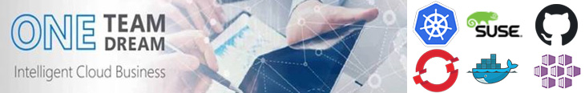

# EMEA Cloud Native Open Source Newsletter – September 2019

## Azure Kubernetes Service (latest [release](https://github.com/Azure/AKS/releases) 2019-08-12)

[Preview Features](https://github.com/Azure/AKS/blob/master/previews.md) :

- Azure Standard load balancer  
- [Azure Monitor for Containers with Prometheus support](https://azure.microsoft.com/en-us/updates/azure-monitor-for-containers-prometheus-support-for-aks-engines/)
- AKS is now available in South Africa North, Brazil South and both China East 2 / China North 2 Azure Regions, and government (preview)
- [Audit logging in Azure Kubernetes Service](https://azure.microsoft.com/en-us/updates/audit-logging-in-azure-kubernetes-service-aks-is-now-available/) (AKS) is now generally available
- [Calico Network Policies](https://azure.microsoft.com/en-us/blog/integrating-azure-cni-and-calico-a-technical-deep-dive/) available in AKS: Calico policies lets you define filtering rules to control flow of traffic to and from Kubernetes pods.

## Azure RedHat OpenShift  

- DL: aro-talk@service.microsoft.com
- OpenShift : their [strategy](https://blog.openshift.com/openshift-kubernetes-where-weve-been-and-where-were-going-part-1/) ([part 2](https://microsofteur.sharepoint.com/teams/EMEAGBBCloudNativeTechnicalSpecialists/Shared Documents/General/NewsLetter/o%09https:/blog.openshift.com/openshift-kubernetes-where-weve-been-and-where-were-going-part-2/))
- [RH OpenShift vs Kubernetes](https://cloudowski.com/articles/10-differences-between-openshift-and-kubernetes/): know the difference

## Azure DevOps

- Kubernetes [integration with Azure Pipelines](https://docs.microsoft.com/en-us/azure/devops/release-notes/2019/build-may#kubernetes-integration-for-azure-pipelines) is now available
- Bi-directional integration of [Pipelines with Jira](https://docs.microsoft.com/en-us/azure/devops/release-notes/2019/sprint-154-update#azure-pipelines-app-for-jira)
- [Azure DevOps CLI](https://docs.microsoft.com/en-us/azure/devops/release-notes/2019/sprint-154-update#azure-devops-cli-general-availability) is now available
- [Multi-stages YAML pipelines](https://devblogs.microsoft.com/devops/whats-new-with-azure-pipelines/)
- Announcing the [Azure Boards app for Slack](https://devblogs.microsoft.com/devops/announcing-the-azure-boards-app-for-slack/)
- For more information: see [Release Notes](https://docs.microsoft.com/en-us/azure/devops/release-notes) or [roadmap](https://docs.microsoft.com/en-us/azure/devops/release-notes/features-timeline)

Github

- [GitHub Actions now supports CI/CD](https://github.blog/2019-08-08-github-actions-now-supports-ci-cd/), free for public repositories
- New GitHub: is this the end of Azure DevOps ? [The answer here](https://www.linkedin.com/pulse/new-github-actions-v2-cicd-feature-thats-awesome-morand/)

## Misc

- [Azure Front Door](https://azure.microsoft.com/en-us/services/frontdoor/) to protect your web apps
- External configuration store pattern avec [Azure App Configuration](https://azure.microsoft.com/en-us/blog/simplify-the-management-of-application-configurations-with-azure-app-configuration/)
- [Integration Service Environment](https://azure.microsoft.com/en-us/updates/integration-service-environments-ise-are-now-generally-available/) allows to inject Logics Apps in your VNets

## Kubernetes

- Kubernetes v1.15 [released](https://github.com/kubernetes/kubernetes/blob/master/CHANGELOG-1.15.md#kubernetes-v115-release-notes)
- [AWS](https://aws.amazon.com/about-aws/whats-new/2019/06/?nc1=h_ls) competitor monitoring:  
  - Amazon [ECS now supports additional resource-level permissions](https://aws.amazon.com/fr/about-aws/whats-new/2019/06/amazon-ecs-now-supports-resource-level-permissions-and-tag-based-access-controls/) and tag-based access controls
  - Amazon [EKS now supports Kubernetes version 1.13](https://aws.amazon.com/fr/about-aws/whats-new/2019/06/amazon-eks-now-supports-kubernetes113-ecr-privatelink-kubernetes-pod-security/), ECR PrivateLink, and Kubernetes Pod Security Policies

- Google Cloud competitor monitoring: Google ANTHOS (previously known as Cloud Services Platform) GA announced during Google Cloud Next’19. Anthos brings together a set of Kubernetes-oriented services [under one logical umbrella](https://cloud.google.com/blog/topics/hybrid-cloud/new-platform-for-managing-applications-in-todays-multi-cloud-world):  
  - GKE: cloud-based Kubernetes clusters running on GoogleCloud Platform  
  - GKE on-prem: Kubernetes clusters, runningon-prem VMWare vCenter, managed by Google  
  - Google Cloud Service Mesh (GCSM): managed Istio offering, delivered as a cluster “addon” for GKE and GKE On-Prem to provide a managed service mesh to control network policies, request resiliency and monitoring
  - Anthos Config Management: config management service  
  - Stackdriver: logging, metrics, and monitoring platform  
  - Cloud Build: cloud-based container build service  
  - Google Marketplace: marketplace of Kubernetes applications that can be deployed on clusters, including : Gitlab, JFrog Artifactory Enterprise, CloudBees Core, CyberArk Conjur, Elastic GKE Logging, Jenkins, Nginx.
  - See [MS BattleCards](https://microsoft.sharepoint.com/teams/GearUp/SitePages/competitorEventrecaps.aspx#Anthos)

## Java Community

- /!\ Oracle java license update with a new Limited Right of Redistribution: this has a direct impact on customers & ISV who cannot anymore ship freely a Java runtime bundled with their application. See also [Java SE LIUM](https://www.oracle.com/downloads/licenses/terms-thirdpartyreadme-java-license.html) (Licensing User Manual)

- If you have any customers who are running or planning to run microservices on Azure Kubernetes Service with Java Spring Boot framework, please come back to us. We would be happy to onboard them in the Preview, completing this [survey](https://microsoft.qualtrics.com/jfe/form/SV_8067P0FXEzPsbpr)

- Installer of [Visual Studio Code for Java developers](https://aka.ms/vscode-java-installer-win) is now Released.

## ISV

- [CloudBees Acquires Rollout](https://www.cloudbees.com/press/cloudbees-acquires-rollout-adding-feature-flag-system), Adding Feature Flag System to Manage Deployment Risk and Accelerate Software Feature Delivery
- [Dependabot](https://dependabot.com/blog/hello-github/) has been acquired by GitHub Introducing new ways to keep your code secure
- Meet [SUSE at MS Inspire](https://www.suse.com/c/suses-guide-to-navigating-microsoft-inspire-2019/), recommended session SUSE Container as a Service Platform on 17/07/2019. Using Eclipse IDE for SUSE Cloud Application Platform
-  Modernizing Legacy Windows Apps With [Kubernetes and PKS](https://content.pivotal.io/blog/modernizing-legacy-windows-apps-with-kubernetes-and-pks): Containers will be able to run anywhere PKS on Windows is supported, including vSphere and public clouds. In the light of recent changes in the Java licensing model by Oracle, the company has decided to further invest itself in the open-source future of Java with its [Pivotal Spring Runtime](https://pivotal.io/pivotal-spring-runtime). Pivotal has just [been bought by VMWare](https://www.bloomberg.com/news/articles/2019-08-22/vmware-agrees-to-buy-carbon-black-for-about-2-billion)

## Next Events

- [DevOps REX](https://www.devopsrex.fr/) in Paris: ETA 17/10/2019
- [Code-One](https://www.oracle.com/code-one/) (formerly JavaOne) 15/09/2019
- [Open Source Summit](https://www.opensourcesummit.paris/): 10/12/2019 in Paris  
- [European Open Source Summit](https://events.linuxfoundation.org/events/open-source-summit-europe-2019/) : 28-30 oct. in Lyon
- [API Days](https://www.apidays.co/paris): 10/12/2019 in Paris

## Microsoft resources

- MS [OSS Blog](https://cloudblogs.microsoft.com/opensource/)
- MS [Azure updates Notes](https://azurenotes.tech/)  
- MS+GitHub loves [OSS](https://azure.microsoft.com/en-us/overview/open-source/)
- [AKS roadmap](http://aka.ms/aks/roadmap)
- Choose [Azure Open Source](https://azure.microsoft.com/en-gb/overview/choose-azure-opensource/)
- Windows Server containers in [Kubernetes](https://aka.ms/k8sWindows)
